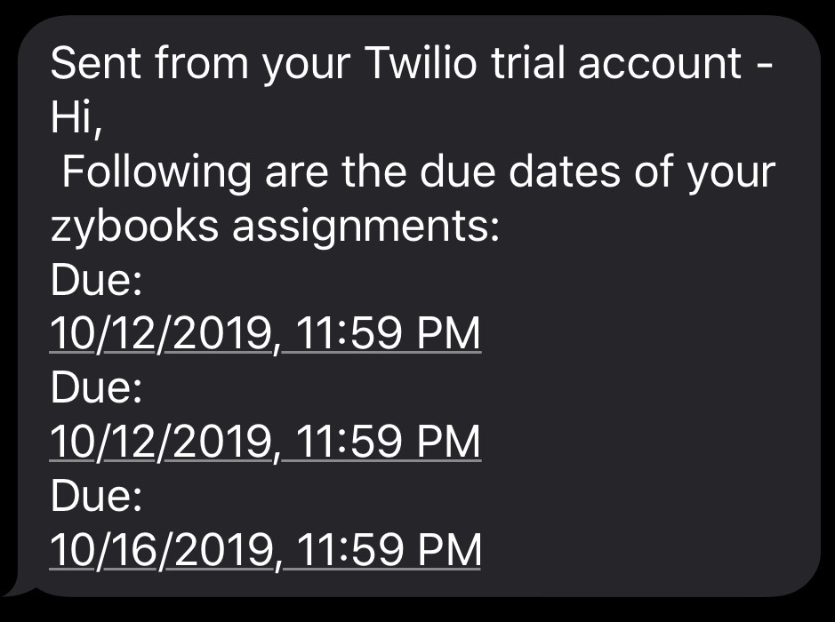

# Zybooks Assignment Reminder

Automate the checking of your Zybooks assignments and send a helpful text to your phone. Instead of checking and forgetting the due dates of your assignments have your assignments due date conveniently texted to your phone for quick access.

\* Code will need to be personalized.

## How to run

You will need python, as well as a few modules for the program to work.

Run: `pip install requirements.txt`
 
Get the ChromeDriver - WebDriver for Chrome [here](https://chromedriver.chromium.org/downloads) and add it to line 13.

Note: Version of your chome driver needs to mactch with your chrome browser version.
  
After customizing the code to your need (see 'Personalization' below) run : `python driver.py`
  
## Personalization

The code will need to be personalized.

On line 8: You will need to add the url of your zybook class.
On line 9: You will need to add your zybooks email.

On line 11: You will need to enter your password (getoass package only works with Command prompt (Windows), terminal(Mac, Linux and FreeBSD)). 
I do not recommend hardcoding them. Use enviroment variables or another form of auth.

On line 36 and 37: You will need Twilio API credentials. 

On line 43: Enter twilio phone number in the format "+1##########"
On line 44: Enter your phone number in the format "+1##########"

## Implementation

I have a slightly modified version of the program which I am running on a Raspbery Pi 3b+. The program runs every morning and will notify me of the due dates of my current assignments. This way I am always notified if I have an assignment due today.

### Contact

Ayush Petigara
email - aarvyushpetigara3@gmail.com
